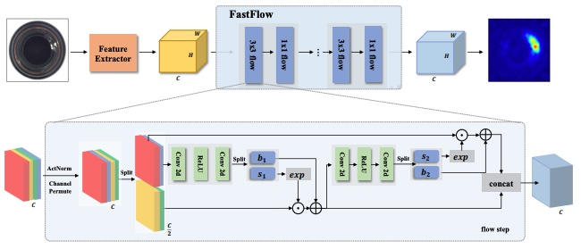

# ⚠️ WiP - FASTFLOW: Unsupervised Anomaly Detection and Localization via 2D Normalizing Flows.

This is the WiP implementation 👷‍♂️ 🚧 of the [FASTFLOW-AD](https://arxiv.org/pdf/2111.07677.pdf) paper.

Model Type: Segmentation

## Description

FASTFLOW model is based on a conditional normalizing flow framework adopted for anomaly detection with localization. It consists of a discriminatively pretrained encoder followed by a multi-scale generative decoders. The encoder extracts features with multi-scale pyramid pooling to capture both global and local semantic information with the growing from top to bottom receptive fields. Pooled features are processed by a set of decoders to explicitly estimate likelihood of the encoded features. The estimated multi-scale likelyhoods are upsampled to input size and added up to produce the anomaly map.

## Architecture

## Usage

`python tools/train.py --model fastflow`

## Benchmark

All results gathered with seed `42`.

## [MVTec Dataset](https://www.mvtec.com/company/research/datasets/mvtec-ad)

### Image-Level AUC

TBD

### Pixel-Level AUC

TBD

### Image F1 Score

TBD

### Sample Results

TBD
